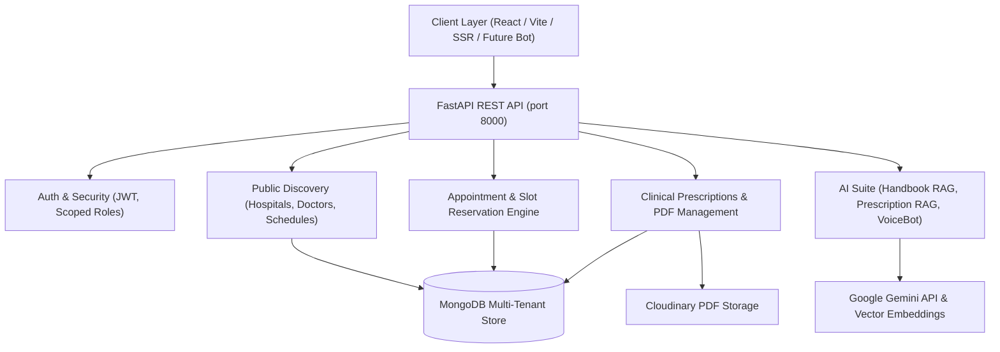

# CityCare Multi-Hospital Platform

Comprehensive multi-hospital healthcare management, patient appointment scheduling, prescription tracking, and AI-assisted care platform.

---

## Architecture Overview



| Component | Stack | Responsibilities |
|---|---|---|
| **`citycare-backend/`** | FastAPI · Motor (Async MongoDB) · Pydantic v2 · JWT · Pytest | Multi-hospital REST API, role-based authorization, doctor availability engine, PDF generator, Handbook RAG, VoiceBot |
| **`citycare-frontend/`** | Vite · React 18 · TypeScript · TanStack Router & Query · TailwindCSS | Patient discovery & 4-step booking workflow, Admin/Manager/Doctor/Patient dashboards |

---

## Quick Start

### 1. MongoDB Database
```bash
# Via Docker
docker run -d --name citycare-mongo -p 27017:27017 mongo:7

# Or start your local Windows MongoDB service
net start MongoDB
```

### 2. Backend Setup
```bash
cd citycare-backend
python -m venv venv
.\venv\Scripts\Activate.ps1
pip install -r requirements.txt
copy .env.example .env
uvicorn app.main:app --reload --port 8000
```

### 3. Frontend Setup
```bash
cd citycare-frontend
copy .env.example .env
npm install
npm run dev
```

- **Frontend Application**: http://localhost:5173
- **Interactive Swagger Docs**: http://localhost:8000/docs
- **Health Check**: http://localhost:8000/health

---

## Multi-Hospital Setup Workflow

Follow this standard procedure to configure a multi-branch healthcare network:

### Step 1: Initialize Database & Super Admin
On backend startup, `app/core/migrate.py` runs idempotent migrations and seeds the default Super Admin:
- **Email**: `admin@citycare.clinic`
- **Password**: `Admin@123`

### Step 2: Super Admin Provisions Hospital Branches
Authenticate as Super Admin (`POST /auth/login`) and create hospital branches:
```http
POST /admin/hospitals
Authorization: Bearer <ADMIN_TOKEN>
Content-Type: application/json

{
  "name": "CityCare Central Hospital",
  "address": "456 Healthcare Blvd",
  "city": "Mumbai",
  "state": "Maharashtra",
  "pincode": "400001",
  "contact_phone": "+919876543210",
  "contact_email": "central@citycare.clinic",
  "working_hours": "08:00 - 20:00",
  "facilities": ["ICU", "Emergency", "Diagnostics Lab", "Pharmacy"],
  "services": ["Cardiology", "Neurology", "Orthopedics", "General Medicine"],
  "status": "active"
}
```

### Step 3: Super Admin Assigns Hospital Managers
Create a manager scoped to a specific hospital branch:
```http
POST /admin/users/manager
Authorization: Bearer <ADMIN_TOKEN>
Content-Type: application/json

{
  "first_name": "Rajesh",
  "last_name": "Kumar",
  "email": "manager.mumbai@citycare.clinic",
  "mobile": "+919876500001",
  "password": "Manager@123",
  "hospital_id": "<HOSPITAL_ID>"
}
```

### Step 4: Provision Specialist Doctors with Schedules
Create specialist doctors linked to the hospital branch with custom availability:
```http
POST /admin/users/doctor
Authorization: Bearer <ADMIN_TOKEN>
Content-Type: application/json

{
  "first_name": "Ananya",
  "last_name": "Sharma",
  "email": "dr.ananya@citycare.clinic",
  "mobile": "+919876500002",
  "password": "Doctor@123",
  "hospital_id": "<HOSPITAL_ID>",
  "specialization": "Cardiology",
  "qualification": "MD, DM (Cardiology)",
  "experience_years": 12,
  "consultation_fee": 800.0,
  "available_days": ["Monday", "Tuesday", "Wednesday", "Thursday", "Friday"],
  "working_hours": "09:00 - 17:00",
  "slot_duration_minutes": 30,
  "valid_slots": ["09:00", "09:30", "10:00", "10:30", "11:00", "11:30", "14:00", "14:30", "15:00", "15:30", "16:00"]
}
```

### Step 5: Operational Schedule Tuning
Both the Super Admin and the branch Hospital Manager can tune doctor schedules:
- **Super Admin**: `PATCH /admin/doctors/{doctor_id}`
- **Hospital Manager**: `PATCH /manager/doctors/{doctor_id}` (strictly scoped to doctors in their hospital)

---

## Doctor Specialization & Availability Model

1. **Weekday-Aware Validation**:
   - Doctors define `available_days` using standard weekday names (`Monday` through `Sunday`).
   - Availability queries (`GET /patient/doctors/{id}/availability?date=YYYY-MM-DD`) resolve the target date's weekday. If the doctor is off-duty on that day, `is_available: false` with empty slots is returned.
2. **Booked Slot Subtraction**:
   - For working days, existing active bookings (`status="booked"`) for that doctor and date are subtracted from `valid_slots`.
3. **Atomic Concurrency Guarantee**:
   - MongoDB partial unique index `(hospital_id, doctor_id, date, slot)` for `status="booked"` guarantees zero race-condition double bookings.
4. **Specialization Filtering**:
   - Patients can filter doctors by specialization across branches via `GET /patient/doctors?specialization=Cardiology` or scoped to a branch via `GET /patient/doctors?hospital_id=<ID>&specialization=Cardiology`.

---

## Database Migrations & Idempotency

- All database indexes and schema backfills are executed automatically during application startup in [migrate.py](file:///d:/CODER%20HI%20KEHDE/Projects/cityspace_hospital_eigi/citycare-backend/app/core/migrate.py).
- **Non-Destructive Backfills**: Uses `$exists: False` queries to add missing hospital metadata (`facilities`, `services`, `working_hours`, `status`) and user fields (`is_active`, `available_days`, `valid_slots`) without overwriting existing data.
- **Safe Inactive State Preservation**: Never resets `status: "inactive"` hospitals or reactivates `is_active: False` users.
- **Unique Indexes**:
  - `users.email` (unique)
  - `hospitals (name, city)` (unique)
  - `appointments (hospital_id, doctor_id, date, slot)` (partial unique WHERE `status="booked"`)
  - `prescriptions.appointment_id` (unique)

---

---

## Telegram Patient Assistant Gateway

A dedicated, isolated conversational gateway (`telegram_gateway/`) for patients built on Hermes Agent architecture principles:

- **Transport Separation**: Dedicated local polling process (`python run_telegram_poller.py`) and FastAPI Webhook (`POST /telegram/webhook`) for production.
- **Persistent Sessions**: MongoDB persistent session state (`telegram_sessions`) with deterministic keys (`tg:private:<chat_id>:0`) and TTL expiry.
- **1-to-1 Identity Mapping**: Salted OTP verification linking Telegram numeric user IDs to patient accounts.
- **Secure Activation**: Telegram registration creates the patient account and sends a secure one-time activation link to set web credentials on the portal.
- **Distributed Rate Limiting**: Multi-worker safe atomic MongoDB counter (`telegram_rate_limits`).
- **Update Idempotency**: Atomic claim on `telegram_idempotency` preventing duplicate bookings.

---

## Verification & Build Results

### Backend Automated Test Suite (`pytest -v`)
- **Total Tests**: **119 passed, 0 failed** (100% pass rate)
- **Coverage**:
  - `tests/test_telegram_gateway.py`: 16 tests (Disabled startup, production validation, markdown escaping, OTP & identity mapping, consent & activation tokens, persistent sessions, distributed rate limiting, update idempotency, discovery flows, booking state machine, AI emergency escalation, webhook security, real OTP providers, password activation lifecycle, idempotency crash/retry, protected prescription PDF delivery)
  - `tests/test_patient_domain.py`: 12 tests (Multi-tenant discovery, weekday availability, inactive status rejection, manager authorization, migration idempotency)
  - `tests/test_cli.py`: 40 tests (CLI subcommands, token resolution, security enforcement, deactivated user blocking)
  - `tests/test_ai_chat.py`: 17 tests (Doctor clinical chat, conversation continuity, rate limits)
  - `tests/test_appointments.py`: 8 tests (Slot booking, double-booking prevention, concurrency)
  - `tests/test_voicebot.py`: 6 tests (Twilio TwiML webhooks, WebSocket audio streams, auth isolation)
  - `tests/test_auth.py`: 6 tests (Signup, login, deactivated user rejection, seed credentials)
  - `tests/test_handbook_rag.py`: 5 tests (PDF extraction, embedding vectors, idempotent ingestion)
  - `tests/test_doctor.py`: 4 tests (Doctor stats, schedule views, public profile)
  - `tests/test_prescription_rag.py`: 3 tests (PDF generation, patient-scoped vector retrieval)
  - `tests/test_prescriptions.py`: 2 tests (Prescription workflow, patient isolation)

### Frontend Production Build (`npm run build`)
- **Status**: **0 errors**, client bundle + SSR Nitro worker generated successfully.

